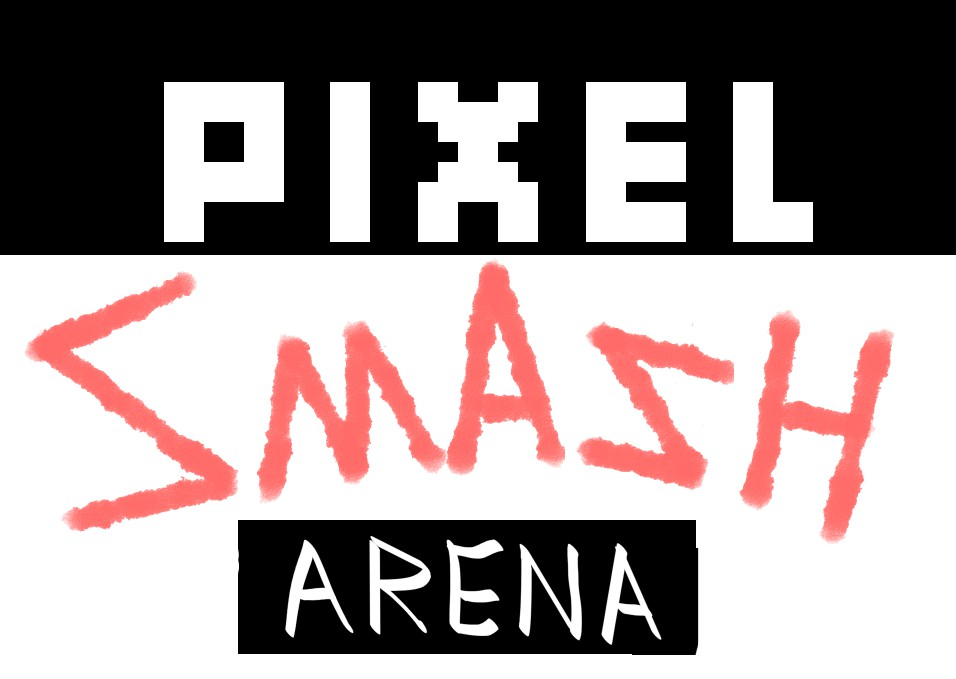

# PixelSmash Areeeenaaa!!!

Spectators! Get your bets ready for the next Season of Pixel Smash! This time we have new Gladiators coming from all corners of the pixel-verse ready to give it all. As the fights go some will continue, some will be pixelated, new fighters will be born from freak cosmic fusion accidents.

# Start the Season!

To start your Phoenix server:

  * Install dependencies with `mix deps.get`
  * Create and migrate your database with `mix ecto.setup`
  * Install Node.js dependencies with `npm install` inside the `assets` directory
  * Start Phoenix endpoint with `mix phx.server`

Now you can visit [`localhost:4000`](http://localhost:4000) from your browser.

Ready to run in production? Please [check our deployment guides](https://hexdocs.pm/phoenix/deployment.html).

## Learn more

  * Official website: https://www.phoenixframework.org/
  * Guides: https://hexdocs.pm/phoenix/overview.html
  * Docs: https://hexdocs.pm/phoenix
  * Forum: https://elixirforum.com/c/phoenix-forum
  * Source: https://github.com/phoenixframework/phoenix
